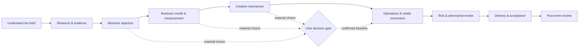

# Ceyuan 3

<p align="center">
  
</p>

<p align="center">
  <strong>An AI skill for decision-centered event planning, plan review, delivery control, and post-event analysis in the China market.</strong>
</p>

<p align="center">
  English · <a href="README.zh-CN.md">简体中文</a>
</p>

> Ceyuan 3 is not a fill-in-the-blank event proposal template. It turns goals, audience value, creative mechanisms, budgets, operations, media conversion, evidence, and review into one traceable planning system.

## Why Ceyuan 3

Most AI-generated event plans look complete while hiding the important failures: invented facts, unverified budgets, vague ownership, broken conversion paths, and decisions silently made on the user's behalf. Ceyuan 3 is designed around the opposite behavior:

- **User-controlled decisions.** The AI prepares options, consequences, and a compact decision card; the user locks material choices before dependent work is finalized.
- **Five task modes.** Build a full plan, explore a direction, review an existing proposal, inspect one module, or run a post-event review.
- **Evidence before confidence.** Facts, assumptions, sources, access state, and verification limits are kept distinct.
- **Deterministic checks.** Standard-library Python tools check budgets, throughput, inventory, schedule dependencies, exclusive-resource conflicts, project state, and delivery requirements.
- **Change-aware delivery.** When a key fact changes, dependent modules and artifacts become stale instead of remaining falsely “complete.”
- **China-market execution.** The reference system covers domestic media, creators, registration, attendance, private-domain conversion, sponsorship, vendor boundaries, and scenario-specific operations.

## Task routing

| What you need | Mode | Typical deliverable |
|---|---|---|
| A complete event plan from scratch | `plan` | Event proposal + decision rationale |
| Fast directions or creative concepts | `quick` | One-page direction with explicit assumptions |
| Review of an existing proposal | `review` | Structured seven-part review; source preserved |
| Budget, evidence, media, operations, or metrics only | `module` | Focused module result |
| Analysis after the event | `retro` | Outcome vs. target, attribution limits, next actions |



The flow is adaptive rather than ceremonial: a budget-only check does not force a full planning sequence, and a read-only review does not rewrite the source proposal.

## Installation

Clone the repository into the skills directory used by your host:

```bash
git clone https://github.com/DONGaOtang/ceyuan-3.git ~/.codex/skills/ceyuan3
```

On Windows PowerShell:

```powershell
git clone https://github.com/DONGaOtang/ceyuan-3.git "$env:USERPROFILE\.codex\skills\ceyuan3"
```

Keep `SKILL.md`, `references/`, `scripts/`, and `schemas/` together. Restart or reload the host if it does not discover newly installed skills automatically.

Requirements:

- A host that supports `SKILL.md`-style skills
- Python 3.10+ for the optional deterministic tools
- No third-party Python packages

## Quick start

Invoke the skill with `/ceyuan3`, `use Ceyuan 3`, or `用策元3`, depending on the host.

```text
Use Ceyuan 3 to draft an event plan. Mark every unknown as an assumption.

Use Ceyuan 3 to review this complete proposal. Return the fixed seven-part
review and do not rewrite the source.

Use Ceyuan 3 to check only the budget. Find gaps, duplicate costs, tax-basis
ambiguity, and unsupported numbers.

用策元3设计这场活动的国内媒介、达人、报名承接和数据计划。

用策元3复盘这些实际数据，区分结果、相关性和可归因结论。
```

By default, full planning is collaborative: the AI completes the analysis for the current decision node, presents options and impacts, and continues after the user confirms the choice. A request such as “give me a draft directly” produces a clearly labeled reference draft; it does not convert unknown assumptions into confirmed facts.

## Deterministic tools

### Plan checks

`check_plan.py` validates structured data extracted from a proposal. It can check budget arithmetic, capacity, ideal throughput, inventory, finish-to-start dependencies, and declared exclusive-resource conflicts.

```bash
python scripts/check_plan.py extracted-plan.json --output checks.json
```

The script does not parse arbitrary Word/PDF files and does not verify permits, suppliers, or real-world availability. See [`references/validation-contract.md`](references/validation-contract.md) for the input contract.

### Project state and invalidation

`project_state.py` tracks facts, dependencies, revisions, stale artifacts, and evidence-backed delivery checks.

```bash
python scripts/project_state.py init project.json --project-id demo
python scripts/project_state.py bootstrap project.json --modules budget delivery media registration
python scripts/project_state.py set project.json --key attendees --value 500 --source "user confirmed"
python scripts/project_state.py validate project.json
python scripts/project_state.py verify project.json --artifact proposal \
  --requirements delivery-requirements.json \
  --reviewer "reviewer name" \
  --method "review method and evidence location" \
  --result pass
python scripts/project_state.py audit project.json --requirements delivery-requirements.json
```

`verify` records a real content review; it does not automatically mark a module ready. A matching file hash proves identity, not semantic correctness. See [`references/project-state.md`](references/project-state.md) and the JSON schemas in [`schemas/`](schemas/).

## Package structure

```text
ceyuan3/
├── SKILL.md                         # Routing and operating rules
├── references/                      # Domain methods loaded only when needed
├── scripts/
│   ├── check_plan.py                # Deterministic numeric/flow checks
│   └── project_state.py             # State, revision, and delivery audit
├── schemas/
│   ├── project.schema.json
│   └── delivery-requirements.schema.json
├── evals/
│   └── test_runtime.py              # Runtime regression tests
├── assets/
├── README.md
└── README.zh-CN.md
```

The skill uses progressive disclosure: `SKILL.md` routes the task, while detailed references are loaded only when the scenario requires them. This keeps a simple budget check from carrying the context cost of every industry and event type.

## Quality boundaries

Ceyuan 3 uses explicit delivery states:

- direction draft
- reviewable proposal
- execution conditions checked
- blocked
- executed result

It does not label a plan “execution-ready” without the relevant resource and approval evidence. Model simulations, static checks, and synthetic regression tests are not presented as market-effect proof. Publishing, paid media, outreach, payment, venue booking, supplier commitment, and CRM writes still require the corresponding user authorization.

## Validation

Run the regression suite from the repository root:

```bash
python -B evals/test_runtime.py
```

The current suite contains 75 standard-library tests covering numeric checks, malformed input, dependency propagation, stale artifacts, evidence files, verification records, and CLI round trips. These are engineering tests, not claims about commercial outcomes.

## License

[MIT](LICENSE) © 2026 DONGaOtang

