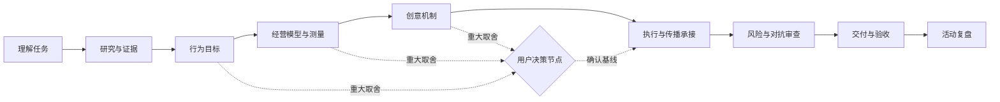

# 策元 3

<p align="center">
  
</p>

<p align="center">
  <strong>面向中国市场的 AI 活动策划、方案审查、交付控制与活动复盘 Skill。</strong>
</p>

<p align="center">
  <a href="README.md">English</a> · 简体中文
</p>

> 策元 3 不是活动方案填空模板。它把业务目标、参与者价值、创意机制、预算、执行、传播承接、证据和验收连接成一套可追溯的策划系统。

## 为什么做策元 3

大量 AI 活动方案看似完整，实际把关键问题藏了起来：编造事实、预算未经核算、职责模糊、转化链路断裂，以及 AI 在未获授权时替用户做了重大选择。策元 3 采用相反的工作方式：

- **决策权归用户。** AI 先准备选项、影响和简短决策卡；用户确认重大取舍后，才定稿依赖该决定的内容。
- **五类任务入口。** 支持从零策划、快速方向、已有方案审查、单模块检查和活动复盘。
- **证据先于信心。** 明确区分事实、假设、来源、访问状态和核验边界。
- **确定性检查。** 仅用 Python 标准库检查预算、吞吐、库存、时间依赖、独占资源冲突、项目状态和交付要求。
- **变更可追踪。** 关键事实变化后，依赖模块和产物会变为过期，而不是继续伪装成“已完成”。
- **适配中国市场执行。** 覆盖国内媒介、达人、报名到场、私域承接、赞助、甲乙方边界和场景化专业操作。

## 任务路由

| 你的任务 | 模式 | 典型交付 |
|---|---|---|
| 从零完成活动策划 | `plan` | 活动方案 + 决策依据 |
| 快速看方向或创意 | `quick` | 一页方向，明确标注假设 |
| 审查已有完整方案 | `review` | 固定七段审查，保留原稿 |
| 只查预算、来源、传播、执行或指标 | `module` | 对应模块结果 |
| 活动结束后复盘 | `retro` | 实际与目标、归因限制、下一轮动作 |



流程会按任务裁剪，而不是机械走形式：只核预算不会强制跑完整策划流程；只读审查也不会擅自重写原方案。

## 安装

把仓库克隆到宿主使用的 skills 目录：

```bash
git clone https://github.com/DONGaOtang/ceyuan-3.git ~/.codex/skills/ceyuan3
```

Windows PowerShell：

```powershell
git clone https://github.com/DONGaOtang/ceyuan-3.git "$env:USERPROFILE\.codex\skills\ceyuan3"
```

请让 `SKILL.md`、`references/`、`scripts/` 和 `schemas/` 保持在同一目录下。如果宿主不会自动发现新 Skill，请重启或重新加载宿主。

运行要求：

- 支持 `SKILL.md` 结构的宿主
- 可选确定性工具需要 Python 3.10+
- 不依赖第三方 Python 包

## 快速开始

根据宿主的调用方式，使用 `/ceyuan3`、`用策元3` 或 `use Ceyuan 3`。

```text
用策元3，直接给我一版活动方案，未知信息请标假设。

用策元3审查这份完整策划案，按固定七段结果输出，不要重写原稿。

用策元3只核预算，指出差额、重复费用、税费口径问题和缺失依据。

用策元3设计这场活动的国内媒介、达人、报名承接和数据计划。

用策元3复盘这些实际数据，区分结果、相关性和可归因结论。
```

完整策划默认采用协作式推进：AI 完成当前决策节点的研究、核算、选项和影响分析，提交决策卡；用户确认后再推进依赖该决定的内容。“直接给一版”可以先得到明确标注状态的参考草案，但未知假设不会因此被写成已确认事实。

## 确定性工具

### 方案检查

`check_plan.py` 检查从方案中提取并结构化的数据，包括预算算术、容量、理想吞吐、库存、finish-to-start 时间依赖和已声明独占资源的冲突。

```bash
python scripts/check_plan.py extracted-plan.json --output checks.json
```

脚本不能直接理解任意 Word/PDF，也不能核实许可证、供应商或现实资源是否可用。输入约定见 [`references/validation-contract.md`](references/validation-contract.md)。

### 项目状态与失效传播

`project_state.py` 记录事实、依赖、修订版本、过期产物和带证据的交付核验。

```bash
python scripts/project_state.py init project.json --project-id demo
python scripts/project_state.py bootstrap project.json --modules budget delivery media registration
python scripts/project_state.py set project.json --key attendees --value 500 --source "用户确认"
python scripts/project_state.py validate project.json
python scripts/project_state.py verify project.json --artifact proposal \
  --requirements delivery-requirements.json \
  --reviewer "实际复核者" \
  --method "复核方法和证据位置" \
  --result pass
python scripts/project_state.py audit project.json --requirements delivery-requirements.json
```

`verify` 只记录真实发生的内容复核，不会自动把模块设为 ready。文件哈希一致只能证明文件身份，不能证明正文语义正确。详细规则见 [`references/project-state.md`](references/project-state.md)，数据结构见 [`schemas/`](schemas/)。

## 仓库结构

```text
ceyuan3/
├── SKILL.md                         # 任务路由与运行规则
├── references/                      # 按需加载的专业方法
├── scripts/
│   ├── check_plan.py                # 确定性数字与流程检查
│   └── project_state.py             # 状态、版本与交付审计
├── schemas/
│   ├── project.schema.json
│   └── delivery-requirements.schema.json
├── evals/
│   └── test_runtime.py              # 运行时回归测试
├── assets/
├── README.md
└── README.zh-CN.md
```

策元 3 使用渐进式披露：`SKILL.md` 负责路由，只有场景真正命中时才加载对应参考文件。一次简单的预算检查不必承担全部行业和活动类型的上下文成本。

## 质量边界

策元 3 明确区分以下交付状态：

- 方向草案
- 可评审提案
- 执行条件已核对
- 阻断
- 已执行结果

没有对应资源和审批证据时，不会把方案标成“执行条件已核对”。模型模拟、静态检查和合成回归测试不能被包装成市场效果证明。发布、投放、外联、支付、订场、供应商承诺和写入 CRM，仍然需要用户对相应外部操作的明确授权。

## 验证

在仓库根目录运行：

```bash
python -B evals/test_runtime.py
```

当前回归套件包含 75 个仅依赖标准库的测试，覆盖数字检查、畸形输入、依赖传播、过期产物、证据文件、核验记录和 CLI 往返。这是工程测试，不是商业效果声明。

## 开源协议

[MIT](LICENSE) © 2026 DONGaOtang

